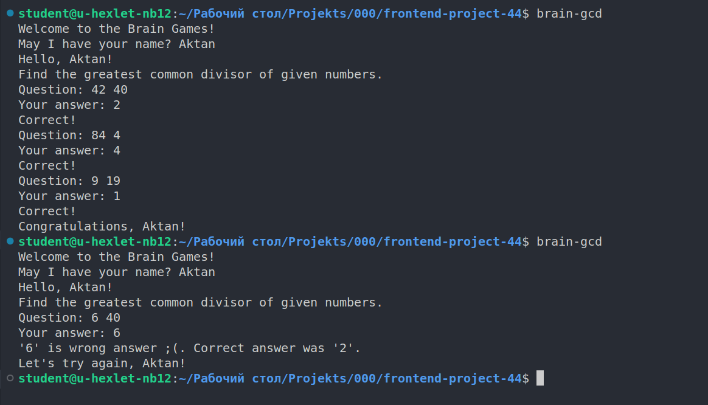

### Hexlet tests and linter status:

# Описание:

Игры разума - это первый проект написанный в онлайн-школе Hexlet.
Представляет из себя набор из пяти консольных игр, построенных по принципу приложений для прокачки мозга. Каждая игра задаёт вопросы, на которые нужно правильно ответить. После трёх верных ответов, игра считается пройденной. Неправильные ответы завершают игру и предлагают её пройти заново.

## Игры:

- Калькулятор. Арифметические выражения, которые необходимо вычислить.
- Прогрессия. Поиск пропущенных чисел в последовательности чисел.
- Определение четного числа.
- Определение наибольшего общего делителя.
- Определение простого числа.

## Установка:

- Убедиться в наличие установленной Node.js версии 12 и выше. Либо установить её командой `sudo apt install nodejs`
- Склонировать или скачать данный репозиторий.
- Находясь в локальной директории проекта, воспользоваться командой `make install`.

## После установки игры вызываются следующими командами:

`brain-games` - Приветствие игры.

`brain-calc` - Выводит на экран числа, с которыми необходимо провести математические операции.

`brain-even` - Необходимо определить, является ли число чётным или нет.

`brain-gcd` - Необходимо вычислить наибольший общий делитель.

`brain-prime` - Определить, является ли число простым.

`brain-progression` - Определить пропущенное число в прогрессии.

# Демонстрация игр:

Brain-even

Brain-calc

Brain-gcd

Brain-progression

Brain-prime

